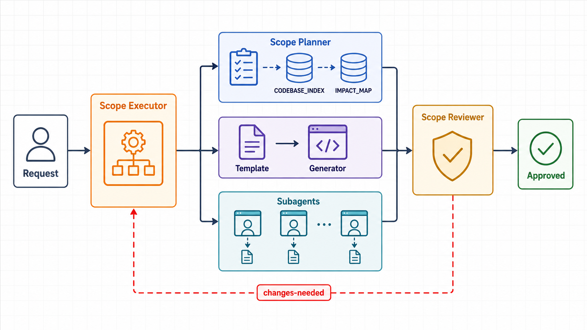
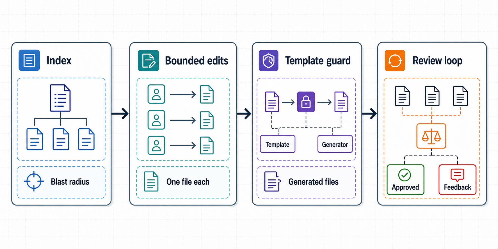

# PatternGuard

> Guard repeated code patterns by mapping each change's blast radius, applying edits within declared bounds, and verifying sibling consistency before commit.

---



The workflow has one entry point: `patternguard-executor`. It reads the index, chooses the correct execution path, bounds each edit, and hands the result to an independent reviewer before anything is considered done.

---

## Why PatternGuard?

AI agents are strongest when the task fits inside one clear context window. They get risky when a change has to propagate across sibling files, generated files, templates, tests, and index contracts. The hard part is not the edit itself; it is knowing the full blast radius before the first line changes.

PatternGuard turns that hidden blast radius into an explicit workflow:

- `patternguard-planner` maps the files and patterns that define the change.
- `patternguard-executor` chooses the right path: solo edit, bounded subagents, or template regeneration.
- `patternguard-reviewer` checks correctness, sibling consistency, index conformance, and generated-file integrity before the work is considered complete.

**The problem without pattern awareness:**

- An agent edits `routes/payments.js` to add a validation field.
- The same validation pattern also lives in `routes/refunds.js`, `routes/disputes.js`, and four other sibling routes.
- Those siblings are easy to miss because they are outside the agent's immediate context.
- The change looks finished, narrow tests can pass, and the bug ships in the first unedited flow a user hits.

That is the scope problem: **the codebase knows the change is cross-cutting, but the agent only sees the file it was asked to edit.**

**What PatternGuard gives you:**

| Without | With |
|---|---|
| Agent infers scope from nearby files | `CODEBASE_INDEX.yaml` declares affected patterns and files before execution |
| One agent edits everything from a bloated context | Executor keeps work bounded: solo for one file, subagents for siblings, generator path for templates |
| Generated files can be edited directly by mistake | Generated-file guard redirects changes to the source template |
| Review happens in the same context that made the change | Reviewer never edits; it can only approve, request fixes, or escalate |
| Pattern drift is discovered in production | Reviewer compares sibling implementations before commit |
| Shared abstractions are introduced too early | Extraction requires proven repetition, divergence, and stable blast radius signals |

**The concrete payoff:**

1. **Blast radius is declared up front** — `CODEBASE_INDEX.yaml` and `IMPACT_MAP.yaml` record which files share a pattern, which tests matter, and when a template must be regenerated.
2. **Execution stays bounded** — one-file tasks use Solo mode; sibling changes get one envelope per file; template-backed patterns go through the generator instead of direct edits.
3. **Pattern drift is treated as a stop sign** — if headers and the index disagree, execution halts and planning updates the map before code changes continue.
4. **Generated files stay generated** — agents are redirected away from `DO NOT EDIT` files and toward the template that owns them.
5. **Review is structurally independent** — `patternguard-reviewer` checks the diff against siblings and the index without touching code, then returns `approved`, `changes-needed`, or `ESCALATE`.
6. **Abstraction is earned, not guessed** — templates are suggested only after repetition, divergence, and stable blast radius prove the pattern needs a single source.

---

## How it works

You only ever invoke one skill. patternguard-executor orchestrates everything else internally.

```
User: /patternguard-executor "change fraud threshold from 0.85 to 0.80"
        │
        ├─ No index yet? → calls patternguard-planner internally
        │    patternguard-planner scans repo, classifies patterns,
        │    produces CODEBASE_INDEX.yaml + IMPACT_MAP.yaml + handoff note
        │    surfaces plan to user for confirmation → returns to executor
        │
        ├─ Index exists, pattern has a template?
        │    → edits generator/templates/<name>.tmpl
        │    → runs the generator
        │    → verifies generated files updated
        │    → passes to patternguard-reviewer
        │
        ├─ Index exists, pattern is duplicated files?
        │    → spawns one patternguard-executor subagent per file
        │    → each subagent edits exactly its assigned file
        │    → passes results to patternguard-reviewer
        │
        └─ patternguard-reviewer checks each file
             approved       → updates index → done
             changes-needed → loops back (with extraction hint if siblings diverged)
             retry ≥ 3      → calls patternguard-planner to re-plan → re-enters execution
```

### The three mechanics



**1. Index as blast radius map**

`CODEBASE_INDEX.yaml` is the single record of which files share logic. Before spawning any subagent, the executor reads it, counts the scope, and asks for confirmation. Subagents never discover siblings on their own — the index tells them.

Files that implement a cross-cutting pattern carry a header comment:
```
// Patterns: payment-validation
// Index: CODEBASE_INDEX.yaml
```
The executor scans these headers as a second drift check. If a file declares a pattern but is absent from the index, execution halts.

**2. Template layer**

Once cross-cutting logic is proven to need a single source of truth, it moves into a template — not a shared runtime function. The generator renders it into flat copies, one per route. What agents actually touch are those flat copies.

Generated files carry:
```
// Code generated by generator/main.go. DO NOT EDIT.
// Patterns: payment-validation
// To change this logic, edit generator/templates/payment_handler.tmpl
// then run the generator. Changes to this file will be overwritten.
```

Any agent that tries to edit a generated file directly is halted by the executor's guard and redirected to the template.

**3. Earned abstraction**

Duplication is the default. Templates are only created when the cost of duplication is proven, not speculated. The executor watches for these signals after each successful change:

- Same files appear in the blast radius for 3+ different change types
- Instructions to each subagent were identical with no meaningful variation
- 3+ sibling files implement the same pattern with no template yet

When 2 of 3 are true, the executor surfaces a suggestion to extract. If sibling inconsistency keeps causing review failures, the reviewer itself flags the pattern as an extraction candidate. Extraction never happens automatically — the user decides.

---

## Skills

| Skill | Invoked by | What it does |
|---|---|---|
| `patternguard-executor` | User | Entry point for all changes. Orchestrates planning, execution, and review internally. |
| `patternguard-planner` | patternguard-executor (or user directly) | Scans repo, classifies patterns, decides when to extract to a template, produces `CODEBASE_INDEX.yaml` + `IMPACT_MAP.yaml` + handoff note. |
| `patternguard-reviewer` | patternguard-executor | Reads diffs only, never edits. Checks correctness, sibling consistency, and generated file integrity. Emits `approved`, `changes-needed`, or `ESCALATE`. |

Call `/patternguard-planner` directly only when you want to inspect or update the index without executing any changes.

---

## Files produced in your repo

| File | Purpose |
|---|---|
| `CODEBASE_INDEX.yaml` | Declares which files share each pattern, and whether they're generated from a template |
| `IMPACT_MAP.yaml` | Pre-declares blast radius per change type — which files to touch, which tests to run, which template to regenerate from |
| `patternguard-handoff.yaml` | Task context passed between skills — what to change, which files are in scope, retry count |
| `generator/templates/*.tmpl` | Single source of truth for cross-cutting logic. Edit these, never the generated files. |

---

## Install — Claude Code

### Local dev / test without installing

```bash
# Skills reload immediately on file save — no restart needed for SKILL.md changes
claude --plugin-dir ./patternguard
```

> Changes to hooks, agents, or `.mcp.json` require `/reload-plugins` or a session restart.

### Manual — repo scope

```bash
mkdir -p ./plugins
cp -R patternguard ./plugins/patternguard
# Then add to your project's plugin config or drop in .claude/plugins/
```

### Manual — personal scope (all repos)

```bash
mkdir -p ~/.claude/plugins
cp -R patternguard ~/.claude/plugins/patternguard
```

---

## Install — Codex

### Repo scope

```bash
# Step 1: copy plugin into your repo
mkdir -p ./plugins
cp -R patternguard ./plugins/patternguard

# Step 2: create the repo marketplace file
mkdir -p .agents/plugins
cat > .agents/plugins/marketplace.json << 'EOF'
{
  "name": "local-repo",
  "interface": { "displayName": "Local Plugins" },
  "plugins": [
    {
      "name": "patternguard",
      "source": { "source": "local", "path": "./plugins/patternguard" },
      "policy": { "installation": "AVAILABLE", "authentication": "ON_INSTALL" },
      "category": "Productivity"
    }
  ]
}
EOF

# Step 3: restart Codex → Plugin Directory → "Local Plugins" → Install
```

### Personal scope (all repos)

```bash
# Step 1: copy to personal plugins folder
mkdir -p ~/.codex/plugins
cp -R patternguard ~/.codex/plugins/patternguard

# Step 2: create the personal marketplace file
mkdir -p ~/.agents/plugins
cat > ~/.agents/plugins/marketplace.json << 'EOF'
{
  "name": "personal-plugins",
  "interface": { "displayName": "My Plugins" },
  "plugins": [
    {
      "name": "patternguard",
      "source": { "source": "local", "path": "./.codex/plugins/patternguard" },
      "policy": { "installation": "AVAILABLE", "authentication": "ON_INSTALL" },
      "category": "Productivity"
    }
  ]
}
EOF

# Step 3: restart Codex
```

### Local dev / test without installing

```bash
codex --plugin-dir ./patternguard
```

---

## Known Limits

**Index drift is caught before execution, not after.**
The executor checks the filesystem against `CODEBASE_INDEX.yaml` and scans file headers before doing anything. If it finds files that match a known pattern but aren't in the index, it halts and invokes patternguard-planner to fix the index before continuing. It won't silently skip siblings. That said, the check only covers already-indexed directories — entirely new directories are invisible until the planner scans them.

**The reviewer approves structure, not behavior.**
`patternguard-reviewer` checks sibling consistency and index conformance, then emits a targeted test checklist derived from the actual diff. It does not run tests, linters, or type checkers. Use the checklist as your manual verification guide before committing.

**Parallel edits will corrupt the index.**
These skills assume one orchestrator writing to the index at a time. If two agents (or two developers running agents) modify the codebase simultaneously, the index can diverge. Treat `CODEBASE_INDEX.yaml` like a lock file — one writer at a time.

**Templates require a generator to be set up in your project.**
The skills manage template editing and tell you to run the generator, but they don't create the generator binary for you. `generator/main.go` (or equivalent) must already exist in your project. On first use, patternguard-planner will flag if no generator is found when it tries to set up an R1 pattern.

---

## License

[MIT](LICENSE) (c) 2026 CalvinZ

Contact: yiwen.calvin@gmail.com
