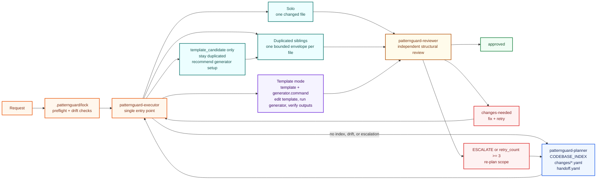
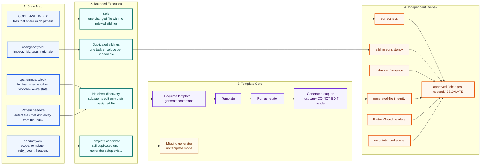

# PatternGuard

> Guard repeated code patterns by mapping each change's blast radius, applying edits within declared bounds, and verifying sibling consistency before commit.

---

Most code intelligence tools help agents see the codebase as a structural map: files, symbols, imports, callers, and dependencies. PatternGuard is different: it turns feature-related repeated code into a change map that an agent must execute against.

Instead of asking only "where is this function used?", PatternGuard asks "which files implement this behavior, what feature or user flow does each one affect, and what execution path keeps the change consistent?" The planner records that feature/pattern scope, the executor keeps edits inside that scope, and the reviewer checks the result against sibling files, generated-file rules, and the index before the work is considered done.

That makes PatternGuard especially useful for codebases where the same product behavior is intentionally repeated across routes, handlers, jobs, UI states, or generated outputs. It does not replace graph tools or search; it gives agents a repo-local protocol for turning discovered relationships into bounded, reviewable execution.

PatternGuard supports several execution modes instead of forcing every change through one workflow. Solo mode handles a bounded single-file edit when there are no indexed siblings. Orchestrator mode handles repeated sibling files by building a concise task envelope for each subagent: the one file to edit, the specific task for that file, the pattern it belongs to, the sibling context needed for consistency, required PatternGuard headers, and the current retry state. Template-backed mode edits the owning template and verifies regenerated outputs when a working generator already exists. Across those modes, each worker receives only what it needs, while the executor keeps the full blast radius, mode decision, and review loop in one place.



The workflow has one entry point: `patternguard-executor`. It reads the index, chooses the correct execution path, bounds each edit, and hands the result to an independent reviewer before anything is considered done.

PatternGuard state lives under `.patternguard/`. On first run, or when legacy root `CODEBASE_INDEX.yaml` / `IMPACT_MAP.yaml` files are found, the planner creates `.patternguard/` and migrates the state there. Legacy `IMPACT_MAP.yaml` entries are split into `.patternguard/changes/index.yaml` plus focused files in `.patternguard/changes/`.

---

## Why PatternGuard?

AI agents are good at making a local edit. Real codebases often need something harder: making the same intent land correctly everywhere that intent already exists.

That gap is where bugs slip in. A request might mention `routes/payments.js`, but the same validation rule may also be duplicated in refunds, disputes, admin flows, tests, generated outputs, or a template that owns all of them. The agent can make the visible file look right while the product still breaks in the first sibling flow nobody told it to inspect.

PatternGuard solves that by making the question **"what else has to change?"** part of the workflow before code changes begin.

It is built around three guarantees:

1. **The blast radius is explicit.** `patternguard-planner` records which files share a pattern, what user-visible behavior each file affects, what tests matter, and what can break if the change is wrong. The scope lives in `.patternguard/CODEBASE_INDEX.yaml` and focused change-impact files, so agents do not have to rediscover it from memory or nearby filenames.
2. **The execution path is constrained.** `patternguard-executor` does not treat every change as "edit the files you saw." It chooses the safe path for the pattern: one solo edit, one bounded subagent per sibling file, or one template edit followed by generator output verification.
3. **The review is independent.** `patternguard-reviewer` never edits code. It checks whether the diff matches the declared scope, whether siblings stayed consistent, whether indexed files still have the right PatternGuard headers, and whether generated files were changed through their template instead of by hand.

The strong point is not that PatternGuard tells agents to "be careful." It gives them a small operating system for repeated code:

| Risk in normal agent edits | PatternGuard behavior |
|---|---|
| The agent only edits the file named in the prompt | The index declares sibling files before execution |
| Context grows until one agent is juggling too much | Work is split into bounded solo, sibling, or template paths |
| Duplicated business logic quietly drifts | Reviewer compares each changed file against its declared pattern |
| Generated files are patched directly | Generated-file guards redirect work to the owning template |
| A stale index gives false confidence | Header scans pause execution when files and index disagree |
| Abstractions are created too early | Template promotion is earned through repetition, divergence, and stable blast radius |

The result is a safer default for agent-operated codebases: repeated logic can remain duplicated when duplication is the right tradeoff, generated code can remain generated, and cross-cutting changes still get the mechanical discipline of a known blast radius, bounded execution, and structural review.

---

## Language fit

PatternGuard is language-agnostic at the workflow level. It does not need a language to have templates built into the language itself. What matters is whether the codebase has **feature-related repeated code** that can be named, indexed, changed in bounds, and reviewed for sibling consistency.

Template-backed mode is optional. It only applies when the project already has a working generator command, such as `go generate`, OpenAPI/GraphQL codegen, a framework scaffold, a source generator, or a custom script. Without that, PatternGuard stays in duplicated-file mode and still protects the change by declaring the blast radius and reviewing siblings.

This rough fit guide is ordered around widely used mainstream languages, not a strict ranking:

| Language / ecosystem | PatternGuard fit | Why it fits or needs care |
|---|---:|---|
| Python | High | Strong fit for repeated FastAPI/Django/Flask routes, Celery jobs, serializers, CLIs, and data pipelines. Template mode is project-specific, usually via Jinja, Cookiecutter, OpenAPI, or custom generators. |
| JavaScript / TypeScript | High | Strong fit for API routes, React/Vue/Svelte components, resolvers, middleware, test fixtures, and generated client/server code. Template mode often comes from framework scaffolds, GraphQL/OpenAPI, or codegen scripts. |
| Java | High | Strong fit for controllers, handlers, DTO mappers, validators, and service-layer patterns. Template mode can work through annotation processors, OpenAPI generators, Maven/Gradle tasks, or custom generators. |
| C# / .NET | High | Strong fit for controllers, request handlers, validators, background jobs, and generated clients. Template mode can use source generators, T4, Roslyn tooling, OpenAPI, or project scripts. |
| Go | High | Go often keeps repeated handler logic explicit, which makes sibling consistency valuable. Template mode fits well when the repo already uses `go generate`, `text/template`, protobuf, OpenAPI, or similar generators. |
| PHP | High | Strong fit for Laravel/Symfony controllers, jobs, policies, middleware, request validators, and repeated framework conventions. Template mode depends on framework generators or project scaffolds. |
| Ruby | High | Strong fit for Rails controllers, jobs, policies, serializers, migrations, and repeated conventions. Template mode can use Rails generators or custom scaffolds, but duplicated mode is usually enough. |
| Kotlin | Medium-high | Good fit for Android feature screens, view models, server handlers, and generated API models. Template mode works when KSP, Gradle tasks, OpenAPI, or project generators already exist. |
| Swift | Medium-high | Good fit for repeated feature screens, view models, coordinators, API clients, and generated models. Template mode depends on project tooling such as Sourcery, SwiftGen, OpenAPI, or custom build scripts. |
| Rust | Medium-high | Useful for repeated API handlers, CLI commands, FFI boundaries, error conversions, and generated protocol code. Needs care because macros/traits often replace duplication; PatternGuard should index repeated behavior, not fight idiomatic abstraction. |
| C / C++ | Medium | Useful for repeated platform branches, error handling, embedded modules, protocol handlers, and generated code. Needs care because macros, build systems, and conditional compilation can hide the real sibling set. |
| SQL / database code | Medium | Useful for repeated migrations, views, stored procedures, permissions, and tenant-specific query patterns. Needs careful review because blast radius is often data- and deployment-dependent, not just file-dependent. |
| R / MATLAB / notebooks | Medium-low | Useful for repeated analysis pipelines or reporting scripts, but less natural when work is exploratory and not organized as durable feature code. Best when notebooks/scripts are productionized. |

The best fit is not determined by syntax. PatternGuard works best when a repo has durable feature slices: "these files implement the same behavior in different places." It is weaker when the code is mostly one-off scripts, deeply dynamic runtime behavior, or already centralized behind a single pure utility with clear callers.

---

## How it works

You only ever invoke one skill. patternguard-executor orchestrates everything else internally.

```
User: /patternguard-executor "change fraud threshold from 0.85 to 0.80"
        │
        ├─ Acquires .patternguard/lock or fails fast if another workflow owns it
        │
        ├─ No index yet? → calls patternguard-planner internally
        │    patternguard-planner inspects relevant structure and likely pattern locations,
        │    produces or updates .patternguard/CODEBASE_INDEX.yaml + change-impact files + handoff note
        │    surfaces plan to user for visibility → returns to executor
        │
        ├─ Index exists, pattern has template + generator.command?
        │    → edits generator/templates/<name>.tmpl
        │    → runs the generator
        │    → verifies generated files updated
        │    → passes to patternguard-reviewer
        │
        ├─ Index exists, pattern is template_candidate only?
        │    → keeps duplicated-file execution
        │    → surfaces that generator setup is still required before template mode
        │
        ├─ Index exists, pattern is duplicated files?
        │    → spawns one patternguard-executor subagent per file
        │    → each subagent edits exactly its assigned file
        │    → passes results to patternguard-reviewer
        │
        └─ patternguard-reviewer checks each file
             approved       → updates index → done
             changes-needed → loops back (with extraction hint if siblings diverged)
             ESCALATE or retry_count >= 3
                            → calls patternguard-planner to re-plan → re-enters execution
```

### The three mechanics



**1. Index as blast radius map**

`.patternguard/CODEBASE_INDEX.yaml` is the single record of which files share logic. Before changing code, the executor reads it, checks whether the affected pattern is template-backed, a template candidate, or duplicated, counts the scope, and surfaces the scope summary for visibility. The summary includes the scoped paths, execution path, feature or behavior impact, risk if wrong, and relevant tests. Subagents never discover siblings on their own — the index tells them.

Files that implement a cross-cutting pattern carry a header comment:
```
// Patterns: payment-validation
// Index: .patternguard/CODEBASE_INDEX.yaml
```
The executor scans these headers as a second drift check. If a file declares a pattern but is absent from the index, the executor pauses code edits and re-runs planning to repair the map before continuing.

Headers are required, not optional. If the planner adds a file to `.patternguard/CODEBASE_INDEX.yaml`, it records any missing header as a `header_repairs` item in the handoff note. The executor repairs those headers during execution, subagents receive the required header in their task envelope, and the reviewer rejects indexed files that are missing or misnaming the `Patterns` / `Index` lines.

**2. Template layer**

Once cross-cutting logic is proven to need a single source of truth, PatternGuard can mark it as a template candidate. It only moves into template-backed execution when the project already has a working generator command. Until then, the pattern stays in duplicated mode and executor still updates each indexed sibling directly.

When template mode is available, the generator renders the template into flat copies, one per route. What agents actually touch are those flat copies.

Generated files carry:
```
// Code generated by generator/main.go. DO NOT EDIT.
// Patterns: payment-validation
// Index: .patternguard/CODEBASE_INDEX.yaml
// To change this logic, edit generator/templates/payment_handler.tmpl
// then run the generator. Changes to this file will be overwritten.
```

Any agent that tries to edit a generated file directly is halted by the executor's guard and redirected to the template. Template-backed patterns are evaluated before execution, so the executor can report that it will edit one template and regenerate outputs instead of incorrectly saying it will spawn one edit subagent per generated file.

**Scope summary includes feature risk**

When a change affects sibling files, PatternGuard does not rely on filenames alone. The executor reads `.patternguard/changes/index.yaml`, opens the matching detailed impact file, and shows what each file can affect before continuing:

```
Scope: 3 files across 1 pattern:

- auth-timeout-response:
  - execution: edit template at generator/templates/auth-timeout-response.tmpl and regenerate
  - routes/checkout.js — affects checkout expired-session response; risk: cart recovery can redirect incorrectly; tests: checkout expired-token scenario
  - routes/billing.js — affects billing expired-session response; risk: payment retry can surface the wrong auth error; tests: billing expired-token scenario
  - routes/profile.js — affects profile expired-session response; risk: account settings can show an inconsistent session error; tests: profile expired-token scenario

Why these files are included: all three routes implement the indexed expired-token response pattern.

Continuing without a confirmation gate.
```

If the changes index or detailed impact file is missing or incomplete, the executor infers the feature impact from the codebase index, handoff note, and surrounding code, and labels uncertain items as inferred.

**3. Earned abstraction**

Duplication is the default. Templates are only created when the cost of duplication is proven, not speculated. The executor watches for these signals after each successful change:

- Same files appear in the blast radius for 3+ different change types
- Instructions to each subagent were identical with no meaningful variation
- 3+ sibling files implement the same pattern with no template yet

When 2 of 3 are true, the executor surfaces a suggestion to mark the pattern as a template candidate. If sibling inconsistency keeps causing review failures, the reviewer itself flags the pattern as a candidate. Promotion to template-backed execution happens only after a generator command exists. Extraction never happens automatically — the user decides.

---

## Skills

| Skill | Invoked by | What it does |
|---|---|---|
| `patternguard-executor` | User | Entry point for all changes. Orchestrates planning, execution, and review internally. |
| `patternguard-planner` | patternguard-executor (or user directly) | Inspects relevant project structure, classifies patterns, decides when to extract to a template, produces `.patternguard/CODEBASE_INDEX.yaml` + change-impact files + handoff note. |
| `patternguard-reviewer` | patternguard-executor | Reads diffs only, never edits. Checks correctness, sibling consistency, and generated file integrity. Emits `approved`, `changes-needed`, or `ESCALATE`. |

Call `/patternguard-planner` directly only when you want to inspect or update the index without executing any changes.

---

## Files PatternGuard uses in your repo

| File | Purpose |
|---|---|
| `.patternguard/CODEBASE_INDEX.yaml` | Declares which files share each pattern, whether it is duplicated, a template candidate, or generator-backed template mode |
| `.patternguard/changes/index.yaml` | Indexes reusable change-impact categories by `name`, `impact`, and detailed impact file path |
| `.patternguard/changes/<change-type>.yaml` | Pre-declares blast radius for one change type — which files to touch, affected user-visible behavior, risk if wrong, tests to run, and which template to regenerate from |
| `.patternguard/patternguard-handoff.yaml` | Task context passed between skills — what to change, which files are in scope, template path when generator-backed, `retry_count`, and required header repairs |
| `.patternguard/lock` | Fail-fast workflow lock for top-level planner/executor runs. Subagents do not create or clear it. |
| `generator/templates/*.tmpl` | Project-provided single source of truth for template-backed patterns. PatternGuard uses this only when a working `generator.command` exists. |

---

## Install — Claude Code

### Local dev / test without installing

```bash
# Skills reload immediately on file save — no restart needed for SKILL.md changes
claude --plugin-dir ./patternguard
```

> Changes to hooks, agents, or `.mcp.json` require `/reload-plugins` or a session restart.

### Manual — repo scope

```bash
mkdir -p ./plugins
cp -R patternguard ./plugins/patternguard
# Then add to your project's plugin config or drop in .claude/plugins/
```

### Manual — personal scope (all repos)

```bash
mkdir -p ~/.claude/plugins
cp -R patternguard ~/.claude/plugins/patternguard
```

---

## Install — Codex

### Repo scope

```bash
# Step 1: copy plugin into your repo
mkdir -p ./plugins
cp -R patternguard ./plugins/patternguard

# Step 2: create the repo marketplace file
mkdir -p .agents/plugins
cat > .agents/plugins/marketplace.json << 'EOF'
{
  "name": "local-repo",
  "interface": { "displayName": "Local Plugins" },
  "plugins": [
    {
      "name": "patternguard",
      "source": { "source": "local", "path": "./plugins/patternguard" },
      "policy": { "installation": "AVAILABLE", "authentication": "ON_INSTALL" },
      "category": "Productivity"
    }
  ]
}
EOF

# Step 3: restart Codex → Plugin Directory → "Local Plugins" → Install
```

### Personal scope (all repos)

```bash
# Step 1: copy to personal plugins folder
mkdir -p ~/.codex/plugins
cp -R patternguard ~/.codex/plugins/patternguard

# Step 2: create the personal marketplace file
mkdir -p ~/.agents/plugins
cat > ~/.agents/plugins/marketplace.json << 'EOF'
{
  "name": "personal-plugins",
  "interface": { "displayName": "My Plugins" },
  "plugins": [
    {
      "name": "patternguard",
      "source": { "source": "local", "path": "./.codex/plugins/patternguard" },
      "policy": { "installation": "AVAILABLE", "authentication": "ON_INSTALL" },
      "category": "Productivity"
    }
  ]
}
EOF

# Step 3: restart Codex
```

### Local dev / test without installing

```bash
codex --plugin-dir ./patternguard
```

---

## Known Limits

**Drift detection is bounded.**
The executor performs a preflight check before editing. It compares `.patternguard/CODEBASE_INDEX.yaml` with files in indexed or previously scanned areas, and scans PatternGuard headers for known patterns. If it finds a file that declares or matches a known pattern but is missing from the index, it pauses code edits and invokes `patternguard-planner` to repair the map before continuing. This is drift detection, not whole-repo discovery: new directories and unmarked files can remain outside PatternGuard coverage until a planning pass includes them. Large existing projects can be indexed incrementally around the requested change instead of deeply mapped on first use.

**The reviewer approves structure, not behavior.**
`patternguard-reviewer` checks sibling consistency and index conformance, then emits a targeted test checklist derived from the actual diff. It does not run tests, linters, or type checkers. Use the checklist as your manual verification guide before committing.

**Template mode requires an existing generator.**
PatternGuard can identify repeated logic as a template candidate, but it only uses template-backed execution when the project already has a working generator command. If no generator exists, the planner keeps the pattern in duplicated-file mode and flags a generator setup task instead of pretending regeneration is available. A project-specific generator such as `generator/main.go` must already exist and know how to render templates into the target files before PatternGuard edits templates and regenerates outputs.

---

## License

[MIT](LICENSE) (c) 2026 CalvinZ

Contact: yiwen.calvin@gmail.com
